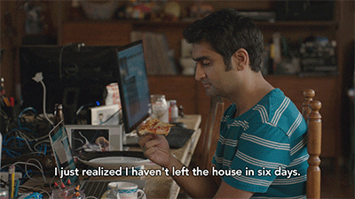

<h1> Hey! Nice to see you.</h1>

Welcome to my page!   I'm Dima, Fullstack developer from  <b>Ukraine, Vinnytsia</b>

<h3>Things I code with</h3>

  
  
  
  
  
  
  
  
  
  
  
  
  
  
  
  
  
  
  
  
  
  
  
  
  
  
  
  
  
  
  

<h3>Where to find me</h3>

  

